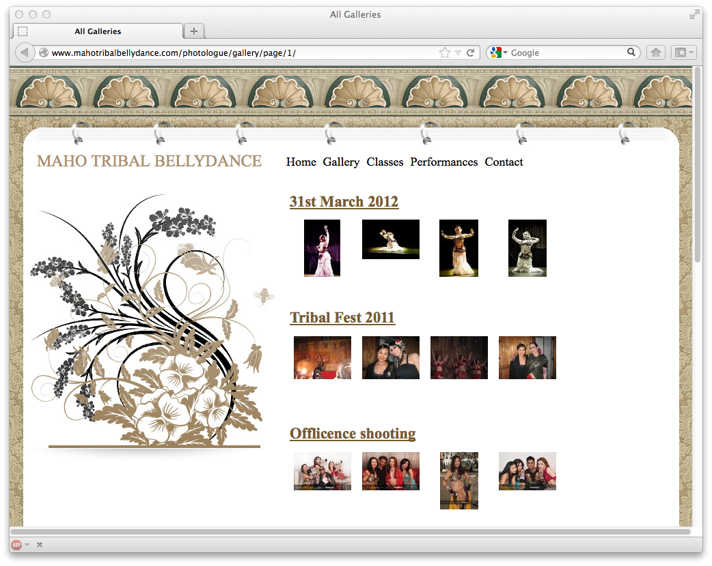

##################
Examples and forks
##################

Here are some examples of Photologue "in the wild", together with a few interesting
forks of the project.

The following sites are using Photologue to manage their images.
If you're using Photologue and would like to have your site linked, just open
a new issue with the URL and a description of the site - or change the docs 
yourself and send a pull request. 

`mahotribalbellydance.com <http://www.mahotribalbellydance.com/photologue/gallery/page/1/>`_

A customised version of Photologue (integrated with a Lightbox):

    
    